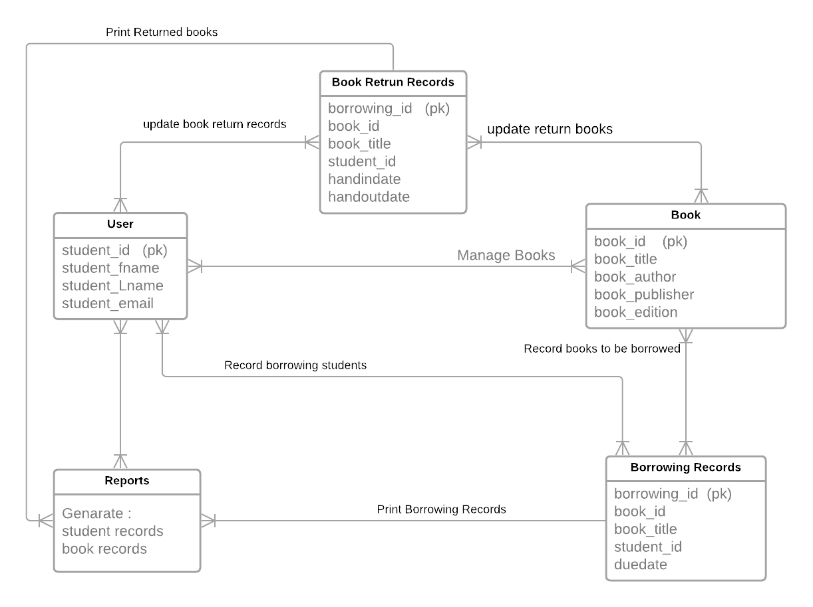

# Proposal for HAND-IN HAND-OUT
## Statement Of Purpose:
- Every university tend to hand out books to students based on their respective courses and intrests. If in case of books shortage or damaged books or other reasons the university tend to ask students to buy textbooks from other sources. After the year is done most of these books are either sold on other websites or students tend to recycle them. 
The project Handy HandOuts aims at developing a functional computerized system to maintain all the day-to-day activity of books in a library. This project has features such as the facility of user login, the ability to view books that are available. The main users of this project would be students.

 ## Overview:
 - We would like to develop an application that allows students to search for books they want to buy, rent, or check out from the university.
 - Students can rent for books on certain price per day and for certain days based on the book that they select.
 
 ## Benefits:
- This application would make it easy for students to check the availability of books that they would wish to check out or rent.
- University can easily get more books, sometimes advanced editions from the students without spending more time to buy.

## Epics / User Stories / Tasks:

## User Story:
- As a user, i want register and then login to the application to view different types of books available.
    
   ### Acceptance criteria checklist:
   - User should register first with all the details and then login to the application.
   - User must be authorized in order to login to the Application.

## User Story: 
- As a user, i want to be able to check the books that are available to rent .
 
   ### Acceptance criteria checklist:
   - To view available books for rent that includes price per day to rent the book.

## User Story: 
- As a user, i want to view different types of books that are available for different courses.
 
   ### Acceptance criteria checklist:
   - To view books that are available for different courses, user must select the course.
 
## Functional Requirements:
- Only authentic user must have the access to the system.
- Only the user must be able to provide the information related to the books.
- System must be able to:
   - Provide the information regarding books.
   - Search for the required books from database.
   - Add new book to the database.
   - Update the number of books in database.
   - Enter data of issued book in Database.
   - Information of returned books.
- User must have the knowledge about the no of copies of a book.
- Same Id’s for 2 or more books shall not be allowed.
- User must check if the book is available or not before issuing.
- User must enter issue and return date in database.

## Performance Requirements:
- The performance of the system should be fast and accurate.
- Hand-In Hand-Out shall handle expected and non-expected errors in ways that prevent loss in information.
- Testing to identify invalid username/password.
- The system should be able to handle large amount of data. Thus it should accommodate high number of books and users without any fault

## Other Requirements:
- System will use secured database.
- System will have different types of users and every user has access constraints.
- Proper user authentication should be provided.
- There should be separate accounts for admin and members such that no member can access the database and only admin has the rights to update the database.
- The project should be open source.
- The Quality of the database is maintained in such a way so that it can be very user friendly to all the users of the database.

## E-R diagram displayed and described:

## User Interface Sketches:

## Technology stack descriptions:

### Backend language + framework 
- The backend language and framework we are using for our project would be **JAVA / Spring**
- Spring Boot is an open source Java-based framework. It is a fully optimized frame work which helps to maintain and modify requirements.

### Backend free app host 
- The Backend app host for our project would be **HEROKU**
### Data host 
- The data host we are planning to use is **PostgreSQL**
### Front-end page plan 
- The front end page we have planned for our project is Build with **Angular**
- Angular is a fully-fledged responsive web design framework, which is used to build single page applications which maintains the same view while navigating to other pages. Angular is built with TypeScript  
### Front-end responsive design 
- The Front-end responsive design would be **Bootstrap**

## Risks and assumptions:
### Risks
- Univeristy may not have all the books that are required for students.
- Books may not be returned back from students on time.
- Students may return damaged books to the library.
### Assumptions
- Students can easily access all the information about books.
- Students can borrow books from library.
- Opportunity to improve end-user experience.

## Deliverable Artifacts:
- Project Plan
- Login and RegisterModule
   - Creating login and register page using Angular
- Developing API's 
   - To add data to the database
- Database Integration
   - Connecting backend to the database
- Testing

## Milestones:
- Implementing Static UI Pages 
- Database Design 
- Developing API's 
- Successfull Database Design and implementation
- Backend and Database integration 
- Testing Application 
- Final Project Delivery 

## Test plan with Requirements:
- The components that involve in test plan are:
   - Test Strategy
     - Test strategy might be analytical or model based.
   - Test Coverage
   - Test Cycles and Durations
   - Test Cases Pass/Fail Criteria
   - Business and Technical Requirements

 
